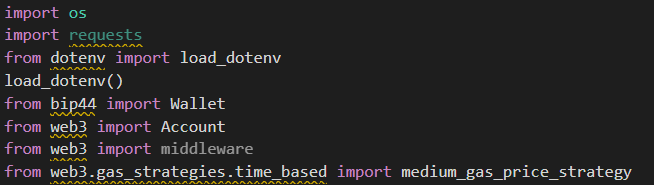

# fintech_challenge_19

This is an application for using a crypto wallet to hire a fintech professional using Ether. The application was built in python, it utilizes streamlit, ganache and the
following list of libraries:

---
## Use
First, you must open a local instance of ganache. Next, navigate to the 'fintech_finder.py' file and type 'streamlit run fintech_finder.py' into the terminal.
From here you will be taken to a browser window with multiple selections for the user to make.
The first option is to select the desired fintech professional

The next option allows the user to select the desired number of hours to hire the contractor.

Once the name and hours are selected the user is presented with the total wage cost. After reviewing the total cost the user will hit the send transaction button, 
this sends the transaction and gives the user a validated transaction hash, located right below the send transaction button.

Now we will see if the transaction went through correctly on ganache.
First, we will see if the Eth has been taken out of the user's account.

Now, on to our final step, we will see if the Eth has been added to the contractor's account.

---
## Contributors
Kevin Gross

---
## License
This program is covered under the MIT license.
